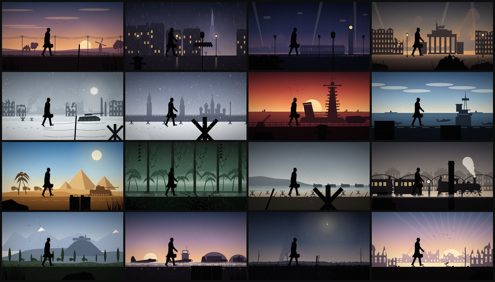
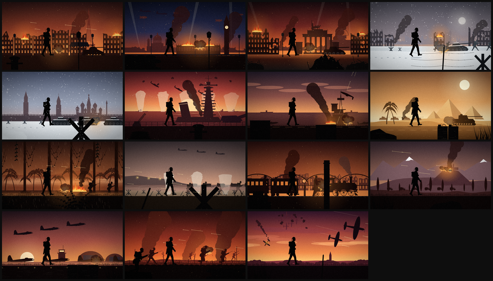

# 二战剪影卡点视频（BPM 106，72 拍 = 40.755 秒，1920×1080 / 30fps）

一个纯黑剪影人物一直向右走，背景每 4 拍 / 2 拍 / 1 拍切换一次二战场景。
音乐第一拍对齐视频 0.000s，逐拍切点见 `cut_sheet.md`（改 BPM 只需改 `render.py` 里的 `BPM` 再重新渲染）。

结构：
- 第 1–4 拍：序幕（乡间小路，平民）
- 第 5–12 拍：每 4 拍切（巴黎雨夜、火车站难民）
- 第 13–36 拍：每 2 拍切，A 平静版（伦敦、柏林、斯大林格勒、日本战舰、北非、莫斯科、丛林、航母、意大利山地、诺曼底、机场、战壕前夜）
- 第 37 拍：闪白进入 B 段，每拍切，B 战火版，人物换成士兵
- 第 61–68 拍：士兵持枪冲锋，半拍闪白
- 第 69–72 拍：尾声（废墟日出，平民），最后一拍渐黑

成片（`video/`）：
- `ww2_106bpm_1080p.mp4`：1080p 无声母版（高码率），剪辑用
- `ww2_106bpm_1080p_sfx.mp4`：带背景音效（无音乐）
- `ww2_106bpm_1080p_sfx_click.mp4`：音效 + 节拍器，检查卡点用
- `audio/sfx_mix.wav`：音效总混音；`sfx_ambience.wav` / `sfx_events.wav` / `sfx_footsteps.wav`：分轨，方便和音乐一起调音量
- `audio/click_106bpm.wav`：节拍器（每小节第一拍高音）

音效（`silhouette_kit/sfx.py` 合成，`soundtrack.py` 按时间线摆放，全部程序生成，无版权素材）：
- 环境：雨、风雪呼啸、海浪海鸥、沙漠风沙、丛林雨和虫鸣、防空警报和轰炸机群、人群和蒸汽火车、鸟叫蟋蟀、远处雷声和钟声
- 事件：B 段每次切换的爆炸（左右声道跟画面位置走）、机枪、舰炮、俯冲啸叫、飞机掠过、坦克、水柱、防空炮
- 脚步：每拍一步（冲锋时每半拍），按地面区分雪地、石板、湿路、沙地、甲板、泥地、瓦砾等
- 转场：进入 B 段前 4 拍的蓄力、闪白重击、结尾耳鸣和声音由闷变清




本项目文件：
- `scenes.py`：17 个场景，每个都有 A 平静 / B 战火两个版本，多层视差滚动 + 最近一层前景遮挡
- `render.py`：时间线 + 镜头（切换推近、B 段震屏、重拍闪白）+ 出片 + 节拍器音轨
- `soundtrack.py`：按时间线给每个镜头配环境声、事件音效和脚步
- `narration.md`：旁白文案定稿（俄/英/日三语）和字幕分段
- `cut_sheet.md`：逐拍切点表

人物、道具、天气、音效合成都来自仓库根目录的 `silhouette_kit/`（画风规范见 `silhouette_kit/STYLE_GUIDE.md`）。

在仓库根目录运行：
```
pip install -r requirements.txt
python3 projects/ww2_silhouette/render.py sheets   # 所有场景 A/B 总览 -> stills/
python3 projects/ww2_silhouette/render.py video    # 成片 + 音效 -> out/
python3 projects/ww2_silhouette/render.py audio    # 只生成音效 wav -> out/
python3 projects/ww2_silhouette/render.py frame 22 # 单帧检查
```
