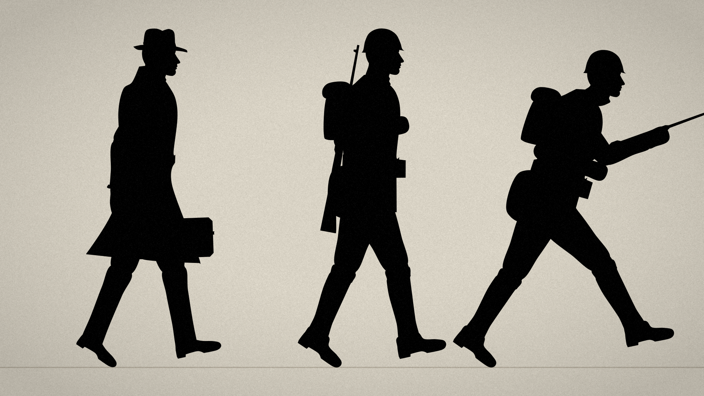

# silhouette_kit · 剪影画风引擎

扁平剪影插画 + 卡点动画的可复用工具包。画风规则见 [`STYLE_GUIDE.md`](STYLE_GUIDE.md)。

## 模块

| 模块 | 内容 | 常用入口 |
|---|---|---|
| `core.py` | 1920×1080 画布、颜色工具、多边形/圆/椭圆/线、竖向渐变、光晕、起伏地形、天际线、残破楼块、反坦克拒马、铁丝网、枯树、飞鸟、T-34、俯视飞机，以及胶片颗粒 + 暗角后期 | `new_canvas()`、`post()`、`vgrad()`、`ridge()`、`skyline()` |
| `figure.py` | 侧面剪影人物：侧脸、礼帽/头盔、风衣/军装、裤腿和鞋、手提箱/步枪；走、跑、端枪冲锋的步态循环 | `figure(ctx, x, 地面y, 身高, 相位, "civ"/"sol", run=, charge=)`、`travel()` |
| `props.py` | 欧式楼房（可战损）、废墟、瓦砾、路灯、电线杆；埃菲尔铁塔、大本钟、议会大厦、圆顶教堂、防空气球、圣瓦西里、克里姆林宫墙、金字塔、修道院；棕榈、柏树、树、风车、农舍；谢尔曼、四号坦克风格、卡车、蒸汽机车、登陆艇、侧视战斗机/轰炸机、航母舰岛、机库、塔台、风向袋；前景遮挡物（草丛、铁丝网桩、沙袋、木箱、油桶、缆桩、绳圈、岩石、蕨叶、立柱、行李、油桶） | `P.facade()`、`P.eiffel()`、`P.locomotive()`… |
| `fx.py` | 雪、雨（含溅落）、沙尘、雾带、海面反光、浪、浪花、落叶、火焰、火星、灰烬、滚动烟柱、蒸汽、爆炸（火球 → 黑烟 → 碎片）、曳光弹、探照灯、枪口火光、热浪扭曲 | `fx.snow()`、`fx.rain()`、`fx.explosion()`、`fx.heat_shimmer()` |
| `sfx.py` | 程序合成音效：雨、风（可加呼啸）、火、海浪、蟋蟀、虫鸣、鸟叫、海鸥、人群、防空警报、钟声、引擎嗡鸣、爆炸、枪声、机枪、舰炮、水柱、飞机掠过、俯冲啸叫、坦克、蒸汽机车、汽笛、蓄力、重击、耳鸣、按地面材质区分的脚步；混音器和混响 | `explosion()`、`footstep(surface)`、`Mix`、`reverb()` |

## 关键约定

- 坐标：1920×1080，人物脚底线 `GY = 870`，人物在 `FIG_X = 720`，身高 `FIG_H = 430`。
- 人物相位：`phase` 走 0→1 是一个完整步态（两步）；走路时 `phase = 时间 / (2 × 一拍)`，脚在每拍落地；跑步时 `phase = 时间 / 一拍`。
- 背景滚动量用 `travel(phase, FIG_H, run, charge, kind)`，脚踩实、不打滑。
- 所有效果函数都是 `(seed, t)` 确定性的，同一帧重复渲染结果一致，适合多进程并行。

## 参考图

- `reference/figure_closeup.png`：平民、士兵、冲锋三种造型特写
- `reference/face_detail.png`：侧脸细节
- `reference/walk_cycle.mp4`：按节拍走路的小样

重新生成：`python3 silhouette_kit/tools/figure_preview.py`
